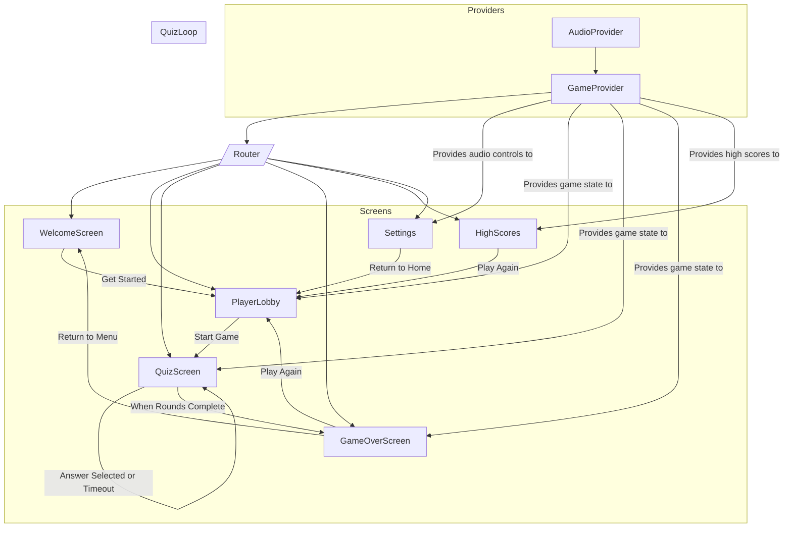

## Tamazight Multi Lingual Word Game

Welcome: Imagine a world where language learning feels as natural as a game. You arrive on the first screen, greeted by a burst of color, a clear invitation to begin, and an instant sense that you’re about to do something meaningful—in this case, learn Tamazight vocabulary through play. That’s no accident. Every element of this app was designed with intention: to engage, to delight, and to educate.

## Why This App Exists

Too often, language apps feel sterile or overwhelming. You’re bombarded with lists of words, grammatical rules, and endless exercises that feel disconnected from real usage. We asked: What if you could learn through challenge, competition, and community? Enter the Tamazight Multilingual Word Game. It combines the joy of a quiz show with the social spirit of friendly rivalry. Whether you’re solo or paired up, you’ll translate Tamazight words, rack up points, and watch leaderboards update in real time. All the while, you’re immersed in a world of vibrant colors and glassy, modern design.

## Getting Started

1. **Clone the Repository**

   ```bash
   git clone https://github.com/your-username/tamazight-multilingual-word-game.git
   cd tamazight-multilingual-word-game
   ```
2. **Install Dependencies**

   ```bash
   npm install
   ```

   This will pull in React, Vite, Tailwind CSS, and supporting libraries like `canvas-confetti` for celebratory effects and `lucide-react` for icons.
3. **Run in Development Mode**

   ```bash
   npm run dev
   ```

   Open [http://localhost:3000](http://localhost:3000) in your browser. You’ll see the Welcome Screen, bathed in the signature gradient, ready to start.
4. **Build for Production**

   ```bash
   npm run build
   npm run preview
   ```

   The built files will be in `dist/`, ready to deploy (Netlify or Vercel configurations are already in place).

## Core Features & Functionality

* **Welcome Screen**: A bold introduction—including a logo and tagline—invites users to “Get Started.”
* **Player Lobby**: Choose between 1-Player and 2-Player modes. Select avatars, customize player names, and pick which language you’ll translate into (English, German, French, Spanish, Italian, Hungarian, Finnish, or Arabic).
* **Quiz Screen**:

  * Displays a Tamazight word (in Tifinagh script) alongside a transliteration hint.
  * Three multiple-choice options appear—one correct translation, two distractors.
  * A 10-second timer bar counts down for each question.
  * Feedback banners instantly confirm “✅ Correct!” or “❌ Wrong!” (or “⌛ Time Up!”).
  * Scores update: correct answers add 3 points; wrong answers add zero.
  * In 2-Player mode, turns alternate automatically; in 1-Player mode, you race against the timer.
  * After each selection (or timeout), confetti animates to celebrate milestones.
  * Once all rounds are complete, you’re directed to Game Over.
* **Game Over Screen**:

  * Shows final scores, highlights winner or declares a tie.
  * Displays avatars and point totals.
  * “Play Again” resets state; “Return to Menu” brings you back to Welcome.
* **High Scores**:

  * Persistent top-5 leaderboard, stored in `localStorage`.
  * Shows player names (or team names), combined scores, and dates.
  * “Play Again” button brings you straight to the lobby.
* **Settings**:

  * **Audio Settings**: Toggle sound effects and background music independently.
  * **Appearance**: Light and dark themes; toggle switches update the entire app.
  * **Game Settings**: Choose 5, 10, 15, or 20 questions per session.
  * **About**: Displays “Version: 1.1.1 (MVP)” and “Created by: Gregory Kennedy.”
* **Navigation Bar**:

  * Persistent at the bottom; glassy backdrop with icons (Home, Players, Leaderboard, Settings).
  * Highlights active route and responds to taps.

Behind the scenes:

* **React Contexts**

  * `AudioContext`: Manages `isSoundEnabled` and `isMusicEnabled`, persists preferences to `localStorage`, and auto-plays or pauses background music (`bgm.mp3`).
  * `GameContext`: Holds entire game state (players, scores, rounds, current word, timer state, theme, etc.). The reducer pattern drives all state transitions: starting a game, selecting answers, switching players, timeouts, and saving high scores.
* **Routing**

  * `react-router-dom` version 6 powers navigation. In `App.tsx`, we wrap everything inside `<AudioProvider>` and `<GameProvider>`, then configure routes:

    * `/` → `WelcomeScreen`
    * `/lobby` → `PlayerLobby`
    * `/play` → `QuizScreen`
    * `/game-over` → `GameOverScreen`
    * `/high-scores` → `HighScores`
    * `/settings` → `Settings`

## Architecture & Flow Diagram

Below is a high-level view of how everything connects. Notice how context providers envelop the router, and how screens transition based on game state and user interactions.



> **Explanation:**
>
> * At startup, `AudioProvider` and `GameProvider` wrap the entire app.
> * The `<Router>` chooses which screen to render based on the URL path.
> * From `WelcomeScreen`, users navigate to `PlayerLobby`.
> * In `PlayerLobby`, selecting mode and languages triggers `startGame()`, which dispatches a `START_GAME` action. Immediately, `nextQuestion()` fires, routing to `QuizScreen`.
> * During the quiz, each answer or timeout runs through the reducer: updates scores, toggles feedback banners, and transitions to the next question (or to Game Over once rounds are done).
> * Finally, `GameOverScreen` either restarts the game (`RESET_GAME`, back to lobby) or returns to the welcome state.
> * High scores are saved and read via `localStorage` whenever a game ends; `HighScores` displays the top 5.
> * `Settings` can be accessed at any time (NavBar) to toggle audio, theme, or round count.

## Design & Color Scheme

We believe a visual identity should feel cohesive and unforgettable. That’s why we chose a five-stop vertical gradient that sweeps from rich violet at the top to electric pink at the bottom. Each stop has been carefully selected to create a sense of depth, energy, and modern flair:

* **0% (Top)**: `#3F1A6C` → *rgb(63, 26, 108)* — a deep purple that evokes focus and mystery
* **25%**: `#5C1F99` → *rgb(92, 31, 153)* — a brighter, royal hue that hints at playfulness
* **50%**: `#8623CB` → *rgb(134, 35, 203)* — a vivid mid-tone that feels electric
* **75%**: `#C1289C` → *rgb(193, 40, 156)* — a warm magenta, inviting and bold
* **100% (Bottom)**: `#E9297E` → *rgb(233, 41, 126)* — a saturated pink that sparks energy and excitement

You’ll see this gradient as the background of every screen, thanks to the `.bg-aurora` utility in `index.css`:

```css
.background {
  background: linear-gradient(
    180deg,
    #3F1A6C 0%,
    #5C1F99 25%,
    #8623CB 50%,
    #C1289C 75%,
    #E9297E 100%
  );
}
```

### Glassmorphism Effects

To keep interactivity clean and ensure readability over vibrant backgrounds, we embraced **glassmorphism**, defined as:

* **15% white background opacity** (`rgba(255, 255, 255, 0.15)`)
* **10px backdrop blur** (`backdrop-blur-[10px]`)
* **White border at 20% opacity** (`border-white/20`)
* **Subtle box shadow** for depth (`box-shadow: 0 8px 32px rgba(0, 0, 0, 0.1)`)

These styles are encapsulated in class names across Tailwind layers:

```css
/* index.css */
@layer base {
  .glass-card {
    @apply bg-surface-light backdrop-blur-[10px] rounded-2xl shadow-glass border border-white/20;
  }
}

/* .shadow-glass => box-shadow: 0 8px 32px rgba(0, 0, 0, 0.1); */
@layer utilities {
  .shadow-glass {
    box-shadow: 0 8px 32px rgba(0, 0, 0, 0.1);
  }
  .bg-surface-light {
    background-color: rgba(255, 255, 255, 0.15);
  }
}
```

* **`.glass-card`** is used for all primary panels (lobby card, quiz card, settings card, high-scores entries).
* **`.btn-secondary`** also applies a glassy backdrop, ensuring buttons feel tactile over the gradient.

## Step-by-Step User Journey

1. **Welcome Screen**

   * You see the full-screen gradient.
   * A centrally placed logo and title set expectations.
   * Click **Get Started** → navigates to `/lobby`.
2. **Player Lobby**

   * Choose either “1 Player” or “2 Players.” The active mode button glows with a semi-opaque primary color.
   * Avatars appear: default images for Player 1 (and Player 2 if 2-Player mode).
   * Under each avatar, a drop-down lets you pick a language (default “English”).
   * Click **Start Game** → dispatches `START_GAME` (scores reset, state updated) and immediately loads first question in `/play`.
3. **Quiz Screen**

   * A card with glassy background displays:

     * A 10-second timer bar at top (in bright “primary” coral).
     * The Tamazight word in large Tifinagh script.
     * A parenthetical transliteration (e.g., `(aɛul)` for “ⴰⴻⵓⵍ”).
     * Three option buttons with numeric labels (1, 2, 3). These buttons are semi-opaque and have a glass border.
   * Tap or press “1”, “2”, or “3” to select.
   * Correct → green highlight + “✅ Correct! (+3 pts)” banner; incorrect → red highlight + “❌ Wrong!” banner; timeout → yellow banner “⌛ Time Up!”
   * After 1.5 seconds, feedback fades; if 2-Player, switch player; else continue; load next question.
   * Confetti bursts whenever a correct answer is registered (canvas-confetti library).
4. **Game Over Screen**

   * Once all configured rounds complete, navigate to `/game-over`.
   * A glass card announces “Game Over.”
   * A trophy icon floats in a yellow circle.
   * Displays winner (or “It’s a tie!”) and both player avatars with scores.
   * Buttons: **Play Again** (resets state, returns to `/lobby`) or **Return to Menu** (resets and goes to `/`).
5. **High Scores**

   * Accessible via NavBar “Leaderboard” icon at any time (or once a game ends).
   * Shows top 5 entries (name(s), combined score, date).
   * Each entry has a glass card with a circular rank badge and a placeholder avatar circle containing initials.
   * Tap **Play Again** to go to `/lobby`.
6. **Settings**

   * From NavBar “Settings” icon.
   * Glass card with toggles:

     * **Sound Effects** (speaker icon)
     * **Background Music** (music icon)
     * **Theme** (sun/moon icon) toggles light/dark; immediately updates root `<html>` class.
     * **Number of Questions** (hash icon) drop-down: 5, 10, 15, 20. Updates `configurableTotalRounds` in state and persists to `localStorage`.
   * **About** section shows version and author details.
   * **Return to Home** button (glass style) sends you to `/lobby`.

## Installation & Development Notes

* **Vite** powers speedy HMR (Hot Module Replacement).
* **Tailwind CSS** is configured in `tailwind.config.js`. You’ll notice custom colors:

  ```js
  extend: {
    colors: {
      'primary-coral': '#FF6B6B',
      'surface-light': 'rgba(255, 255, 255, 0.1)',
    },
    backgroundImage: {
      'gradient-game': 'linear-gradient(135deg, #FF6B6B 0%, #4ECDC4 100%)',
    },
  }
  ```

  While `.bg-aurora` overrides that with our custom gradient on every screen.
* **ESLint** and **TypeScript** ensure type safety and code quality. Lint rules live in `eslint.config.js`.
* **Local Storage** keys:

  * `tamazightSoundEnabled` & `tamazightMusicEnabled` for audio prefs.
  * `theme` for light/dark mode.
  * `configurableTotalRounds` for round count.
  * `tamazightHighScores` stores the top-5 leaderboard.

## How to Contribute

* Fork the repo and branch off `main`.
* Install dependencies (`npm install`).
* Create a new feature or fix branch: `git checkout -b feat/your-feature`.
* Make sure to update or add tests (if applicable).
* Submit a PR—give it a descriptive name, reference any issues, and include screenshots or GIFs if you added UI changes.

## A Final Note 

This isn’t just another language app—it’s an invitation. An invitation to learn, to connect, to explore culture through words that have profound meaning. So jump in, challenge a friend, track your progress on the leaderboard, and watch your Tamazight vocabulary flourish—one vibrant screen at a time.

Enjoy the journey,
*—Gregory Kennedy*


